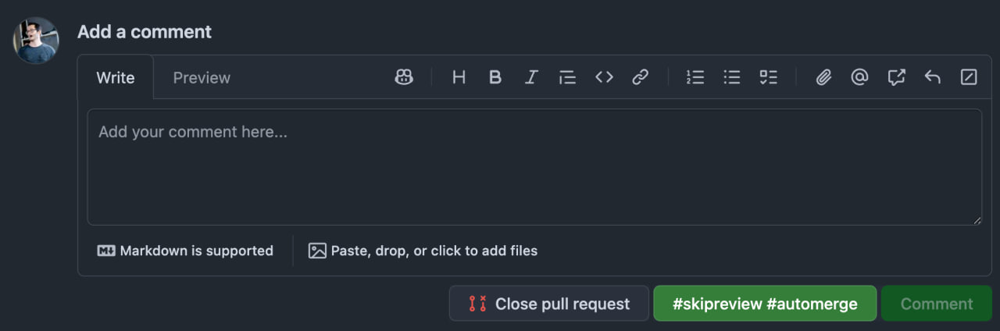

# skipreview-automerge-button-for-github

Chrome extension that adds a one-click `#skipreview #automerge` button to GitHub PR comment forms.



## Install

Install from the [Chrome Web Store](https://chromewebstore.google.com/detail/skip-review-auto-merge-bu/ijgbficjenlkjebcfaccdamhhapgbdni).

<details>
<summary>Install from source</summary>

Run the install script:

```bash
curl -fsSL https://raw.githubusercontent.com/guyca/skipreview-automerge-button-for-github/master/install.sh | bash
```

Then follow the printed instructions to load the `dist/` folder in Chrome.

Or manually:

```bash
git clone https://github.com/guyca/skipreview-automerge-button-for-github.git
cd skipreview-automerge-button-for-github
yarn install && yarn build
```

Then go to `chrome://extensions/`, enable **Developer mode**, click **Load unpacked**, and select the `dist` folder.

</details>

## How it works

Detects GitHub comment forms and injects a button next to the submit button. Clicking it fills the textarea with `#skipreview #automerge` and submits. The button is disabled if you've already typed something.

## Dev

```bash
yarn dev    # dev server with HMR
yarn build  # production build → dist/
```
